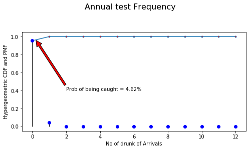
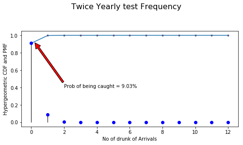
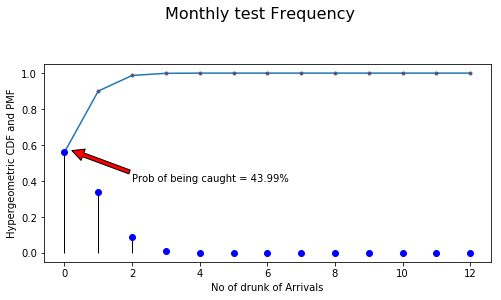
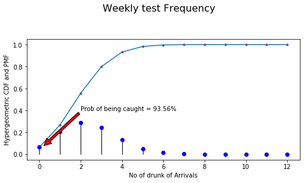
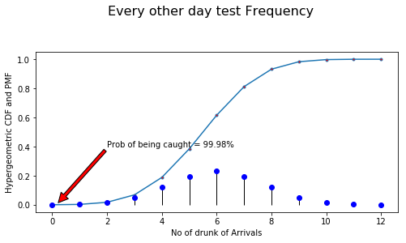
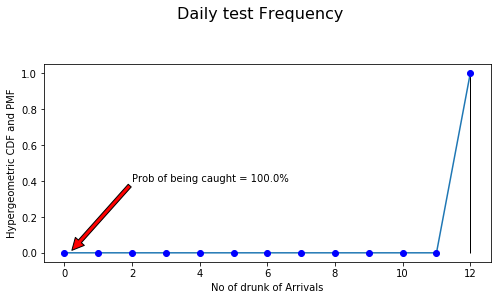

# Hypergeometric Distribution
Using Scipy's Hypergeometric Distribution

What's the probability of catching someone turning up to work drunk? There are 260 working days in the year and the subject is known to turn up 12 times drunk in the year. The graphs show the chances of catching them depending on the number of tests in a single year. The CDFs show the probability of not being caught so 1 is subtracted from the first value in the array to calculate the percentage for the annotated value.

